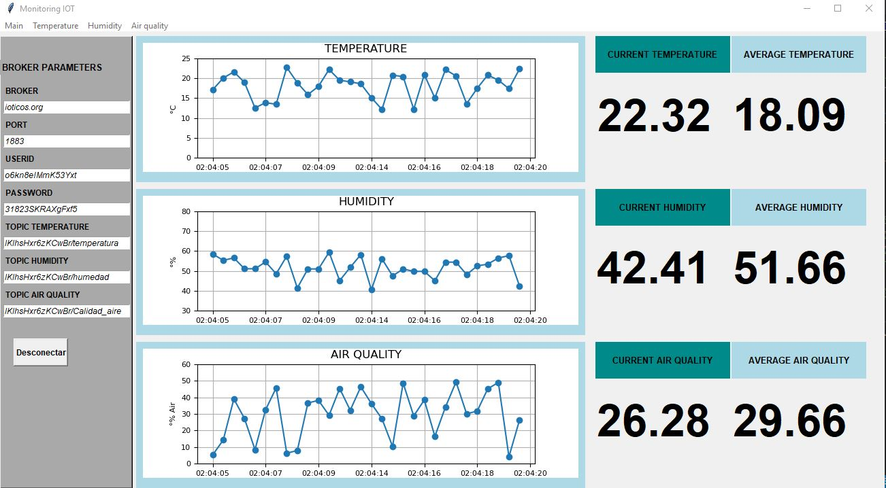

# MONITORING SYSTEM
## Objetive
Monitoring the environment variables:
- Temperature
- Humidity
- Air Quality 
This variables are sent from a ESP32 board to a computer through MQTT and could be showed, exported in a interface created in python.

## ESP32 board
In this project is used a ESP32 to monitoring the environment variables (Temperature, Humidity, Air quality) and send the data to the online broker through MQTT using WIFI module of ESP32.  
In the ESP32 folder there is arduino project. In that project, all the variables are simulated by a random numbers which are under limits referenced to the real behaviour of the environment variables.  

## Broker
All the data collected by the ESP32 are sent to MQTT Broker in three different topics.

## Python Interface
The interface was develpment in python v3.7, the code is in the GUI_inter.py file
The interface has a parametrs setting box in left side. In this one the user could configure: broker address, port, user, password, topic of each parameter.
In upper side there are four tabs that indicate 4 pages: Main, Temperature, Humidity and Air quality.

### Main Page
In center side the three variables are shown in a real time graph and in the right side current values and average values are displayed.

 

  

### Temperature Page, Humidity and Air Quality Page  

In center side the variables are shown in a real time big graph, in the right side current value and average value are displayed, also there is a treeview with date,time and data. This information could be exported to a CVS file called output.  

 

  

 

  

 

  

## MQTT Test
The file prueba_mqtt.py is a simple program to test the communication with the broker and the correct subscription to the diferent topics

